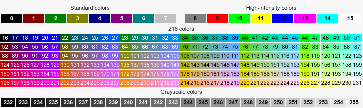

# Options and configuration

## Read-only environment variables

When f4 runs a user-defined command it exports the following variables to the command's environment:

Name           | Description
:---           | :----------
`F4_SEARCH_IN` | current search path
`F4_VTE`       | process id of the embedded terminal

## Changeable environment variables

f4 has no configuration file of its own.  You can configure f4 by setting environment variables.
To persistent your configuration export and set `F4_`-prefixed variables in your shell profile file.
For one-off use set variables on the command line, i.e. `env F4_FONT_NAME="Bold Italic 12" f4`

Here is the list of environment variables and their default values.
Variables that affect terminal colors are listed in a separate section.

**Security note** -- f4 does not run in a sandbox and these variables are no exception. _Setting wrong or malicious values for these variables could harm your data and software._  The author of f4 takes no responsibility for any damage.

----
```sh
F4_SEARCH_PATH="."  # the current folder
```

`F4_SEARCH_PATH` can also be changed in the GUI by pressing the folder icon.
The read-only counterpart of this variable is `F4_SEARCH_IN`.

----
```sh
F4_FONT_NAME="Monospace 11"
```

`F4_FONT_NAME` affects the font displayed in the terminal.
The value is a [Pango](https://pango.gnome.org) font description string ending with the desired font size.  Obtain a list of font descriptions for your system by running `pango-list` in a terminal.

----
```sh
F4_FOLLOW_SYMLINKS="true"
```

`F4_FOLLOW_SYMLINKS` can be enabled/disabled via the GUI by ticking its associated checkbox.
`F4_FOLLOW_SYMLINKS` determines which results to print when a chain of symbolic links is traversed. If this option is true then the result is the initial link and the ultimate target otherwise the result is just the initial link.  This option corresponds to find command's own options `-L` (true) and `-P` (false).  See also [find](https://www.mankier.com/1/find#Options).

----
```sh
F4_EXPANDER="false"
```

`F4_EXPANDER` represents the initial state (open/close) of GUI expander labelled "Advanced...".
If "true" then f4 starts with the Advanced dialog expanded.

----
```sh
F4_FZF="fzf"
```

The `fzf` command.  Useful if you need to use a particular version of fzf.

----
```sh
F4_GTKDIALOG="gtkdialog"
```

The `gtkdialog` command.  Useful if you need to use a particular version of gtkdialog.

---
```sh
F4_BAT="bat"
```

The `bat` command.  If `bat` is installed it will be used to colorize help pages invoked with `C-H`.
To default to monochrome colors unset `F4_BAT`.
See also `F4_THEME_BAT` in the _Colors_ section.

----
```sh
F4_HOTKEY_ESC="0:F1:0xff1b"
```

`F4_HOTKEY_ESC` is the key that quits f4's main window.  This key takes precedence over all other keys.
It is intercepted at the GUI level before the terminal has a chance to see it.  If you need to use `ESC` in the terminal for any reason, you should redefine `F4_HOTKEY_ESC`.

**Redefining hotkeys**

To redefine any `F4_HOTKEY_?` hotkey change its value according to the following format: `<modifier>:<label>:<accelerator>`.

`<modifier>` is 1 for the `Shift` key, 2 for `Alt`¹, and 4 for `Control`.
`<label>` is shown in the GUI.  
`<accelerator>` is the hexadecimal representation of the keycode.  

For example, `F4_HOTKEY_ESC="1:F8:0xffc5"` redefines `Shift+F8` as the key to quit f4's main window.

Advanced tip:
If your GTK configuration sets option `gtk-can-change-accels = 1` then you will be able to change hotkeys on-the-fly when you press `F10` to display f4's menu.

¹ `Alt` does not work on GTK-+2 builds.  

----
```sh
F4_HOTKEY_F1="0:F1:0xffbe"
```

`F4_HOTKEY_F1` defines the key that switches input focus between the GUI expander and the search prompt in the terminal.  When the expander is closed, pressing `F1` opens it and switches focus to the stylized Help button. Then you can press `ENTER` to get help or press the `TAB` key¹ repeatedly to jump through other advanced controls.  When you press `F1` repeatedly input focus switches cyclically between the Help button and the search prompt.

¹ You can also use the arrow keys and all other standard keyboard navigation shortcuts. However, the left and right arrow keys are bound inside the Help field so you need to press the `TAB` key to break out.

See also _Redefining hotkeys_ under `F4_HOTKEY_ESC`.

----
```sh
F4_HOTKEY_F2="0:F2:0xffbf"
```

`F4_HOTKEY_F2` opens the folder browser dialog.

See also _Redefining hotkeys_ under `F4_HOTKEY_ESC`.

----
```sh
F4_HOTKEY_F3="0:F3:0xffc0"
```

`F4_HOTKEY_F3` opens the dialog to edit keep-out paths.

See also _Redefining hotkeys_ under `F4_HOTKEY_ESC`.

----
```sh
F4_HOTKEY_F4="0:F3:0xffc1"
```

`F4_HOTKEY_F4` opens the cache folder `F4_CACHE_PATH` if it exists.

See also _Redefining hotkeys_ under `F4_HOTKEY_ESC`.

----
```sh
F4_BROWSER="$BROWSER"
```

`F4_BROWSER` is the command used for viewing the local help HTML file. The default is the value of variable `$BROWSER` if set, otherwise `xdg-open`.

----
```sh
F4_CACHE_PATH="$XDG_CACHE_HOME/f4"  # otherwise $HOME/.cache/f4
```

`F4_CACHE_PATH` is the folder in which the `C-S` and `C-Z` actions [save the current result list](saving-and-reusing.md).

----
```sh
F4_CASE_SENSITIVE=""
```

By default f4's searches and keep-out patterns (`F4_KEEP_OUT_PATHS`) are not case-sensitive.
if `F4_CASE_SENSITIVE` is set then f4 will use case-sensitive search terms and keep-out path patterns.

----

```sh
F4_KEEP_OUT_PATHS="'/aufs/*' '/dev/*' '/lib/*' '/lib64/*' '/proc/*' '/sys/*' '/tmp/*'"
```

`F4_KEEP_OUT_PATHS` can be edited in the GUI.
The value is a list of space-separated patterns.
A pattern in _single quotes_ is a [shell-style wild card pattern](https://en.wikipedia.org/wiki/Glob_\(programming\)#Syntax) to match against the _full paths_ of folders eligible for searching. When the pattern matches the path of a folder f4 will not visit this folder.

* Dot `.` and slash `/` match themselves.
* Start a pattern with `./` to match under the current search path.
* Start a pattern with `*/` to match anywhere in the search tree.
* End a pattern with `/*` to match the content of a folder but not the folder itself.
* Start the list with `#` to disable its use therefore making f4 visit all encountered matches.
* By default matching is case-insensitive unless `F4_CASE_SENSITIVE` is set.

----

```sh
F4_KEEP_OUT_FILE_SYSTEMS="devfs devtmpfs proc sysfs"
```

`F4_KEEP_OUT_FILE_SYSTEMS` can be edited in the GUI.
The value is a space-separated list of names of file system types to match against the available file systems¹.
f4 will not visit folders and files located in these file systems.
The default value reflects special file systems that commonly do not contain user's files and can be ignored in order to speed up searching.

¹ Linux file `/sys/filesystems` lists the available file system types.  

**Advanced** -- One can spot a special case for operating systems inspired by Puppy Linux's layered file system¹.
These use file system layers to load SFS files and the save file.  Files loaded this way get multiple entry points, which can result in duplicated search hits.  Excluding layered file system may reduce the amount of files that f4 needs to examine.

Note that in these systems the root file system `/` is the mount point of a layered file system, so if layered file systems are kept out, f4 will not list files and folders under `/`.  Here is an incomplete list of layered file system types: `aufs` `fuse.luufs` `overlay` `squashfs` `unionfs` `fuse.unionfs`.  Which type is used to mount `/` depends on your variant, with `aufs` and `overlay` the most common ones.

¹ Puppy Linux, Fatdog64 Linux, DogLinux/DebianDog and others.

### Executing commands

----
```sh
F4_FILE_LOCATE_COMMAND="rox -s \"\$F4_SEARCH_IN/\$1\""
```

f4 runs the _locate command_ `F4_FILE_LOCATE_COMMAND` when you press the `ENTER` key.  The command you specify will be wrapped in its own bash script in which `$F4_SEARCH_IN/$1` is the full path of the selected file.

When multiple files are selected a new command instance runs for each file.

----
```sh
F4_FILE_OPEN_COMMAND="rox \"\$F4_SEARCH_IN/\$1\""
```

f4 runs `F4_FILE_OPEN_COMMAND` when you press key `C-O`, Ctrl+O.  The command you specify will be wrapped in its own bash script in which `$F4_SEARCH_IN/$1` is the full path of the selected file.

When multiple files are selected a new command instance runs for each file.

----
```sh
F4_FOLDER_OPEN_COMMAND="xdg-open"
```

You can change this command keeping in mind that is it used stricly to open folders.

----
```sh
F4_DEBUG=""
```

`F4_DEBUG` is intended for support and development use.

### Colors

```sh
### f4's default dark color theme
#            bg_color fg_color cursor_bg_color cursor_shape
F4_THEME_TERM="#3a3a3a #d0d0d0 #d0d0d0 0"
F4_THEME_FZF="bg:235,bg+:234,fg:252,fg+:252,info:143,border:240,spinner:108,hl:65,header:143,pointer:160,marker:231,prompt:143,hl+:108,preview-bg:235,preview-fg:252"
F4_THEME_BAT="Coldark-Dark"
```

These variables define the overall color theme:

`F4_THEME_TERM` - affects the default terminal colors.  Specify colors as X11 color values, that is, X11 properties.

`F4_THEME_FZF` - affects fzf's colors and paints over the default terminal.  Specify colors as ANSI 256-color codes.

`F4_THEME_BAT` - affects colors of the help pager and matters only when `FZF_BAT` is defined.

See also some stunning palettes at [fzf wiki's color page](https://github.com/junegunn/fzf/wiki/Color-schemes).  The meaning of each field is described in [the manual](https://www.mankier.com/1/fzf#Options-Display).

**X11 and ANSI 256 equivalent color values**

[cheatsheet](https://jonasjacek.github.io/colors/).

**256 color table**



[source with full explanation](https://en.wikipedia.org/wiki/ANSI_escape_code#8-bit)

----

[index](index.md)

